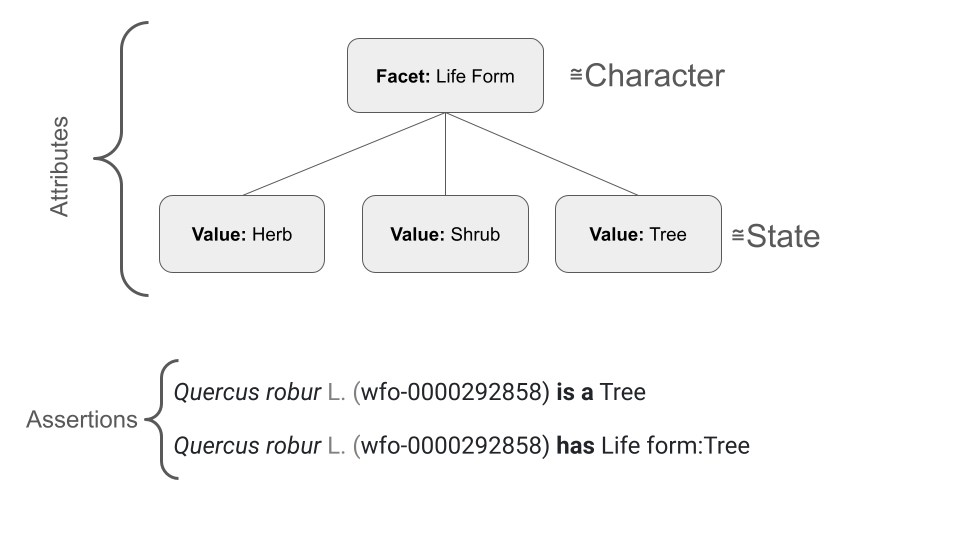
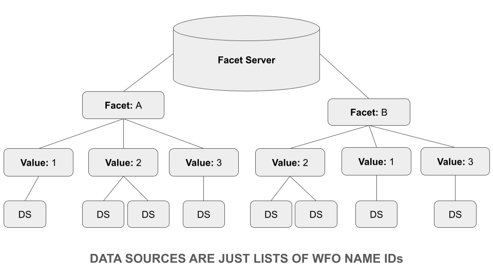

# WFO Faceting Service

This is a content management system (CMS) for simple facet data and text snippets to "decorate" the pure nomenclature and classification data that is generated by the WFO Plant List.

## Facets, Facet Values and Data Sources

"A faceted classification is a classification scheme used in organizing knowledge into a systematic order. A faceted classification uses semantic categories, either general or subject-specific, that are combined to create the full classification entry. Many library classification systems use a combination of a fixed, enumerative taxonomy of concepts with subordinate facets that further refine the topic."

https://en.wikipedia.org/wiki/Faceted_classification

The attributes that taxa  possess and are used for subsetting are organized as Facets and Facet Values. These are synonymous to character and character states often used in identification keys but the faceting terminology is adopted to show the primary purpose is information retrieval not identification. 'Habit' is an example of a facet and 'tree' of facet value.

The expert group who maintain the association between a name and a facet value are called the Data Source. A Data Source is a single, simple list of names that possess a facet value. An __organisation__ might be responsible for multiple Data Sources. The DA for the facet value "IUCN Category:Critically Endangered" would be the IUCN's list of critically endangered plant species. The DA for "IUCN Category:Least Concern" would be the IUCN's list of plants of least concern. In this example one organisation, IUCN, would be responsible for multiple data sources.

A facet value may have multiple DAs. The World Checklist of Vascular plants supplies distribution data that can be rendered as ISO countries DA

Each facet value might have multiple Data Sources. 

## Names, Taxa and Inheritance of Facet Values

Facets are linked to __Names__ not Taxa. The facet service holds no knowledge of the placement of names within a taxonomy. This is for two reasons:

1. Most data available for inclusion will be tagged with Names (typically in the form of name strings) not to specific taxa. 
2. The WFO taxonomy will change as our knowledge improves and the scoring of taxa needs to change too.

During the process of indexing the facet service will use the WFO Plant List index to calculate the facet values for a particular __Taxon__. The Plant List will provide the taxonomic placement of names and the facet service will follow these rules:

1. If the facet is flagged as heritable start at the root of the classification and work down the hierarchy to the target taxon each facet value of each accepted __name__ encountered will be added to the list of facet values for the taxon. This means, for example, that all the species within a family of shrubs don't individually have to be scored as shrubs.
2. Facet values of the immediate synonyms of the taxon will be added to the taxon.

If the facet is not flagged as heritable then the taxon will only have values that are scored directly to its name and its direct synonyms. This is more applicable for facets such as geography.

This algorithm expands on our knowledge of the hierarchy without getting overly complex and leading to unexpected consequences as might occur if we included all the synonyms of all the parent taxa or subtaxa. By and large species (or their synonyms) will be scored to facet values. Occassionally genera or families will be scored for facet values that are uniform for all species.

### Facet Data Import format

Lists are maintained directly through the user interface or by providing CSV files. These CSV files are either uploaded or pulled from a URL. The first row of the CSV file should contain column headings. The first column should contain valid ten digit WFO IDs. Rows beyond the header that don't have a valid WFO ID in the first column will be ignored. Other columns in the CSV file are imported as unparsed metadata that will be displayed to the user on request as name-value pairs with the column headers. They should not therefore contain confidential or confusing data. The [name matching tool](https://list.worldfloraonline.org/matching.php) produces files in the right format to be uploaded to the facet service.

CSV files must be UTF-8 encoded, comma separated, use double quotes as the delimiting character and backslash as the escape character. No other variants of CSV are accepted.

## Text Snippets

The facet service also handles text snippets bound to taxon __names__. The mechanism is similar to the way facet value data is handled. Snippet sources are defined which specify a category for the snippet (e.g. general, lifetime, morphology) and a language as a two letter [ISO 639 code](https://en.wikipedia.org/wiki/List_of_ISO_639_language_codes). There is no inheritance of snippet data.

### Text Snippet Import Format

Text snippets data sources are CSV files that are uploaded directly to the server. They are not pulled from URLs or harvested. This is because snippet sources are expected to be the product of one off processing of published taxon descriptions rather than more dynamic data services. We only plan to import a flora or monograph once.

The first row of the file should be a header row. Subsequent rows must all start with a valid ten digit WFO ID. Rows that don't start this way will be ignored. The second column of the row should contain the actual snippet text. Subsequent columns will be treated as metadata in the same way as for facet value data.

CSV files must be UTF-8 encoded, comma separated, use double quotes as the delimiting character and backslash as the escape character. No other variants of CSV are accepted.

## Implementation

The facet server is implemented as a MySQL 8.* database with a PHP based web interface. This allows users and administrators to login and manage facets, facet values and sublists of names that have those facet values as well as text snippets. The facet server calls an instance of the WFO Plant List application API to facilitate this. No nomenclatural or taxonomic data are stored in the facet server, only WFO IDs. There is, however, a caching of nomenclature in the server and in the clients browser for performance reasons. These caches are perioidally purged.

At index time a script on the facet server calls a SOLR index directly and __updates__ the SOLR document for a taxon. This can either be done for individual taxa or as a batch process. This is a process of _decorating_ an existing index that was created from a WFO Plant List data release. The index already contains the nomenclatural and taxonomic information for the complete list of vascular plants and bryophytes. The facet indexing process adds fields containing data from the facet server to these existing SOLR documents.

For performance reasons the data that is added to each taxon document for faceted searching is just the facet IDs and IDs representing the provenance. A separate process makes SOLR documents containing labels for facet, facet values and data sources. This acts as a data dictionary so that we can render the facet information in a human readable way. Additionally label data is added to each taxon document as text so that those documents will be found in free text searches using words in facet labels.

### Summary of Docs in SOLR

The facet service creates a bunch of SOLR docs and these can get confusing but are actually pretty simple. The main documents are augmented name/taxon documents. All the others hold metadata that is merged in to in search results.

- __name/taxon docs__ These are created by the Plant List data release and have no 'kind' field. They have a wfo_id_s which is the ten digit id of the name and their __id__ field is the full qualified 16 digit id of doc within the classification. The __classification_id_s__  field is very useful as it filters to a particular data release. e.g. 2024-12. These are the documents that are decorated (updated) by the facet service. These documents can have the following fields:
  - __wfo-f-*\_ss__ A faceting field. * is the db id of the facet. Contains the values of this facet for this taxon in the form wfo-fv-\*. This is the id of the facet document containing the metadata for the facet (see below). Adding "\_provenance_ss" to the end give the field containing the provenance in this document. 
  - __wfo-fv-*\_provenance_ss__ A string that can be parsed to give the provenance of the facet value scoring. * is the db id of the facet value.
  - __wfo-f-*\_t__ The text of the facet values present in this taxon. Enables freetext search by facet. Not used for rendering.
  - __snippet_text_categories_ss__ The catagory (subject) of the snippet. e.g. morphology or distribution.
  - __snippet_text_languages_ss__ The lanuage the snippet is in.
  - __snippet_text_name_ids_ss__ The WFO IDs that the snippets were attached to (maybe synonym of the taxon remember)
  - __snippet_text_ids_ss__ The ids of the snippets so that we can recover the snippet that is stored as a separate document in the 
  - __snippet_text_bodies_txt__ The content of the snippets. These are not rendered but here so we can search by text.
  - __snippet_text_sources_ss__ The id of the source so we can facet on it.
  - __facets_last_indexed_i__ Time stamp of when the facets were last indexed so we can selectively reindex if needed.

- __wfo-facet__ These docs are identified by having the __kind_s__ field set to "wfo-facet". There is one per facet and they contain a __json_t__ field that holds a json description of all the values for that facet. Their __id__ is of the form wfo-f-* where * in the id of the facet in the database.
- __wfo-facet-value-score__ metadata for the scoring of a facet. Identified by a __kind_s__ set to "wfo-facet-value-score". The id is wfo-fvs-wfo-0123456789-1-2  where 1 is the source_id and 2 is the value ids in the database. 
- __wfo-snippet-source__ These docs are identified by having the __kind_s__ field set to "wfo-snippet-source". There is one per data source and they have the metadata for the data source in a __json_t__ field. Their __id__ is of the form wfo-ss-* where * in the id of the datasource in the database.
 - __wfo-facet-source__ These docs are identified by having the __kind_s__ field set to "wfo-facet-source". There is one per data source and they have the metadata for the data source in a __json_t__ field. Their __id__ is of the form wfo-fs-* where * in the id of the datasource in the database.
- __wfo-snippet__ metadata for an individual snippet. __kind_s__ field is set to "wfo-snippet". ID is wfo-snippet-* with the database id.

## Facet Ideas

Below is just a brain dump of some ideas for facets

### IUCN - Global Threat Level
- Least concern etc

### IUCN - Locally Threatened
- On a national list somewhere

### CITES 
- Do they have clear global categories?

### Country
- ISO 2 Letter designation for political boundaries

### Climatic Zone
- Arctic = Above 66.5 N or S
- Boreal = Approximately 50 to 66.5 N or S - variable with oceanic zones
- Temperate = 23.5 to 50 approximately N and S
- Subtropical = 23.5 to 35 N or S
- Tropical = between the tropics 23.5 N and S

### Habitat
- Forest Q4421
- Grassland Q1006733
- montane Q112229112
- Deserts
- Aquatic-freshwater
- Aquatic-marine
- Aquatic-coastal

### Pollination Vector
- Wind
- Insect
- Bats
- Birds
- Non-flying vertebrates
- Molluscs
- Crustaceans

### Leaf Form
- Simple
- Pinnate (all flavours)
- Palmate

### Signature Character
- Succulent
- Spiny
- Aromatic foliage
- Aromatic flowers
- Big tree
- Small herb

### Floral form
- Actinomorphic (multiple axes of symmetry)
- Zygomorphic (only one axis of symmetry)
- Asymmetric (No axis fo symmetry)
- Compound pseudanthium or umbel (Different flower shapes)
- Non-showy wind pollinated

### Habit

https://en.wikipedia.org/wiki/Raunki%C3%A6r_plant_life-form

https://en.wikipedia.org/wiki/Plant_life-form

### AusTraits as a source

https://traitecoevo.github.io/austraits.build/index.html
https://bie.ala.org.au/species/https:/id.biodiversity.org.au/taxon/apni/51286863

### Family keys as a source?

https://www.colby.edu/info.tech/BI211/PlantFamilyID.html

Also Delta Intkey of Angiosperms

